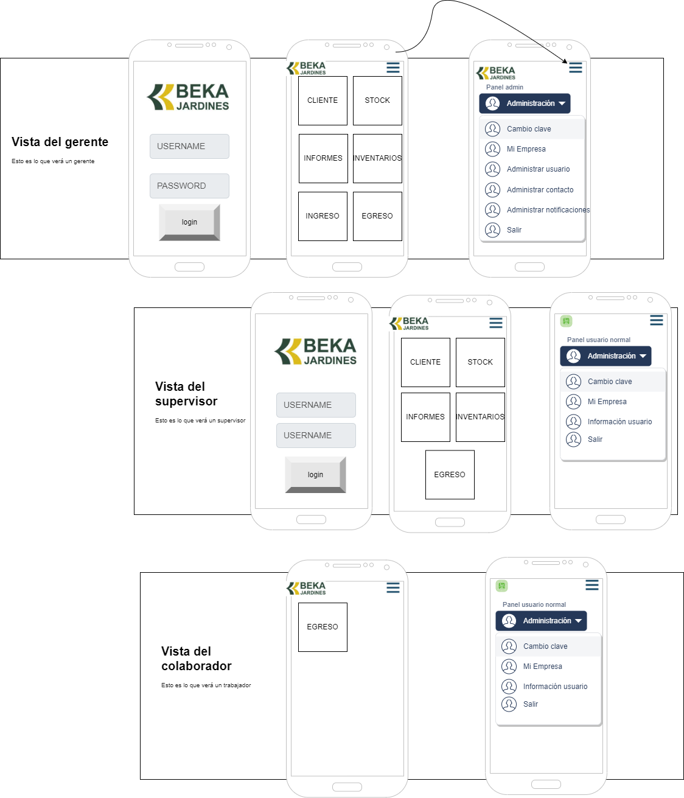
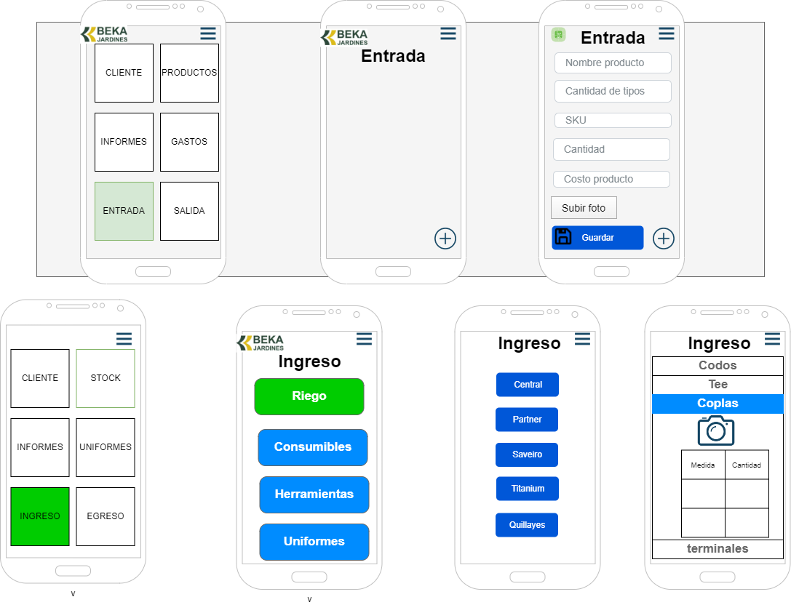

<div align="center">
  <a href="https://marfullsen.github.io/bekapp/" rel="noopener">
    
  </a>
</div>

<h1 align="center">Proyecto Bekapp</h1>

<div align="center">

<!-- [](https://www.mongodb.com/) -->
<!-- [](https://expressjs.com/) -->
[](https://vitejs.dev/)
<!-- [](https://nodejs.org/) -->

</div>

<div align="center">
  Gestión de stock de Jardines Beka.
</div>

## 📘 Últimas actualizaciones 👀 
- Documentación creada.

## 📝 Contenidos 📂 

- [¿Qué es este proyecto?](#about)
- [¡Empecemos!](#getting_started)
- [Prerequisitos](#prerequisites)
- [Instalación](#installing)
- [¿Cómo usar?](#usage)
- [Capturas de pantalla](#screenshots)
- [Producción](#deployment)
- [Contribuir](../CONTRIBUTING.md)
- [Tecnologías usadas](#built_using)
- [Autores](#authors)
- [Reconocimientos](#acknowledgement)

## 🧐 ¿Qué es Bekapp ? <a name = "about"></a>

Bekapp es un sitio de gestión de inventario para Jardines Beka.

<div align="center">
  <a href="https://marfullsen.github.io/bekapp/" rel="noopener">
    
  </a>
</div>

## 🏁 ¡Empecemos! <a name = "getting_started"></a>

Sigue las siguientes instrucciones para ejecutar el FrontEnd. Ver [Producción](#deployment) para lanzar una versión final.

### 📘 Prerequisitos <a name = "prerequisites"></a>

- Instalar [Git](https://git-scm.com/downloads)

- Instalar [Node](https://nodejs.org/en/download/)

###  🔧 Instalación <a name = "installing"></a>

Primero clonar este proyecto.

```sh
git clone https://github.com/Marfullsen/bekapp
cd bekapp
```

Instalar las dependencias del FrontEnd.

```sh
npm install
```

## 🎈 Modo de uso <a name = "usage"></a>

Para levantar el FrontEnd en modo desarrollo.

```sh
npm run dev
```

Ahora entrar al enlace que aparece en consola. [http://127.0.0.1:5173/](http://127.0.0.1:5173/)

## Capturas de pantalla

<div align="center">
  <a href="https://marfullsen.github.io/bekapp/" rel="noopener">
    
  </a>

  <a href="https://marfullsen.github.io/bekapp/" rel="noopener">
    
  </a>

  <a href="https://marfullsen.github.io/bekapp/" rel="noopener">
    
  </a>
</div>

## 🚀 Producción <a name = "deployment"></a>

Para pasar a producción, alojar la base de datos, el front y el back en alguna nube, exponer los puertos y listo.

## ⛏️ Tecnologías usadas <a name = "built_using"></a>

<!-- - [MongoDB](https://www.mongodb.com/) - Base de datos -->
<!-- - [Express](https://expressjs.com/) - Framework de servidores -->
- [Vite.js](https://reactjs.org/) - Framework para cliente
<!-- - [NodeJs](https://nodejs.org/) - Entorno del servidor -->

## ✍️ Autores 👌 <a name = "authors"></a>

- [Nelson Marfull](https://github.com/NelsonMarfull) - Programador BackEnd.
- [Marfullsen](https://github.com/Marfullsen) - Programador FrontEnd.

## Mockups

<div align="center">
  <!-- Referencia para más mockups.
  <a href="https://marfullsen.github.io/bekapp/" rel="noopener">
    
  </a>
  -->

### Principal

  <a href="https://marfullsen.github.io/bekapp/" rel="noopener">
    
  </a>

---

### Clientes

  <a href="https://marfullsen.github.io/bekapp/" rel="noopener">
    
  </a>

---

### Stock

  <a href="https://marfullsen.github.io/bekapp/" rel="noopener">
    
  </a>

---

### Informes

  <a href="https://marfullsen.github.io/bekapp/" rel="noopener">
    
  </a>

  <a href="https://marfullsen.github.io/bekapp/" rel="noopener">
    
  </a>

---

### Ingreso

  <a href="https://marfullsen.github.io/bekapp/" rel="noopener">
    
  </a>

---

### Egreso

  <a href="https://marfullsen.github.io/bekapp/" rel="noopener">
    
  </a>
</div>

## 🎉 Reconocimientos, agreadecimientos y más. <a name = "acknowledgement"></a>

- [VS Code](https://code.visualstudio.com/) + [Volar](https://marketplace.visualstudio.com/items?itemName=Vue.volar)
- https://adrian-galicia.dev/blog/configurando-vue-router-en-vue-3-vite/